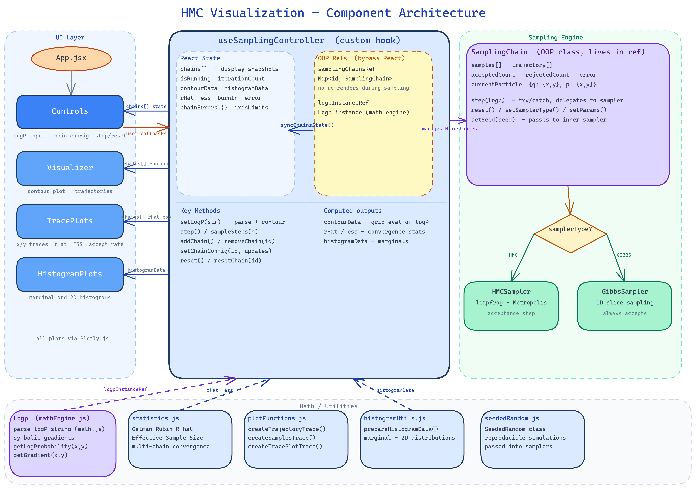

# HMC Visualization

Interactive web application to visualize the Hamiltonian Monte Carlo (HMC) and Gibbs sampling algorithms.
Run simulations, explore phase space trajectories, and analyze convergence with real-time diagnostics.

## Features

- **Interactive Simulation**: Tunable parameters per sampler (Step Size, Integration Time, Mass for HMC; Step Multiplier for Gibbs).
- **Multiple Sampling Algorithms**:
  - **HMC**: Hamiltonian Monte Carlo with leapfrog integrator and Metropolis acceptance.
  - **Gibbs**: Gibbs Sampling with Slice Sampling for robust 1D conditional updates ("Manhattan" trajectories).
- **Target Distributions**: Choose from predefined distributions (Gaussian, Rosenbrock, Donut, etc.) or define your own custom log-probability function.
- **Multi-Chain Support**: Add or remove independent chains dynamically. Each chain can use a different sampler type and parameter set.
- **Sampler Comparison Mode**: When chains use different sampler types, the app automatically switches to comparison mode — per-chain ESS, no R-hat (meaningless across different samplers), and side-by-side histogram panels labelled by sampler.
- **Fast Sampling Mode**: Batch-processes all iterations before rendering, for rapid exploration without frame-by-frame animation.
- **Seed Configuration**: Per-chain random seed input for fully reproducible simulations.
- **GIF Recording**: "Start/Stop Recording" button captures the trajectory plot frame-by-frame and downloads a `sampling-recording.gif` when stopped.
- **Visualizations**:
  - **2D Trajectory**: Real-time visualization of the particle's path in phase space.
  - **Trace Plots**: Monitor X and Y coordinates over time to detect mixing issues.
  - **Histograms**: Marginal (1D) and Joint (2D) histograms. In comparison mode, side-by-side panels are shown per chain.
- **Diagnostics**:
  - **Gelman-Rubin (R-hat)**: Convergence diagnostic computed across chains (same sampler type only).
  - **Effective Sample Size (ESS)**: Joint ESS when chains share the same sampler; per-chain ESS in comparison mode.
  - **Burn-in Control**: Specify initial samples to discard to ensure analysis on the stationary distribution.

## Architecture



The application is built around a central `useSamplingController` hook that bridges React's state model with OOP sampling objects:

- **UI Layer** (`App.jsx`, `Controls`, `Visualizer`, `TracePlots`, `HistogramPlots`) — pure display components that receive state and callbacks as props. All plots use Plotly.js.
- **`useSamplingController` (custom hook)** — single source of truth for all React state. Holds chain configs, iteration counters, contour data, and statistics. Maintains `SamplingChain` OOP instances in refs (not state) to avoid re-renders during hot sampling loops. Exposes callbacks (`setLogP`, `sampleSteps`, `addChain`, `removeChain`, etc.) to the UI. Implements `allChainsCompatible()` to detect when chains share the same sampler type and params, switching between merged and per-chain post-processing automatically.
- **Sampling Engine** — `SamplingChain` wraps a single Markov chain: instantiates the concrete sampler, accumulates samples and trajectory points, and delegates each step. Sampler type decides between `HMCSampler` (leapfrog integrator + Metropolis acceptance) and `GibbsSampler` (coordinate-wise 1D slice sampling, always accepts). `defaultConfigs.js` provides initial parameter shapes for each sampler type.
- **Recording** — `useRecording` hook captures Plotly graph frames via `Plotly.toImage` during sampling and encodes them into a downloadable GIF using `gifshot`.
- **Math / Utilities** — `Logp` (mathEngine.js) parses user-supplied log-probability strings with math.js and computes symbolic gradients. `statistics.js` provides Gelman-Rubin R-hat and ESS. `plotFunctions.js` generates Plotly traces.

The key design decision is the **ref-state duality**: `SamplingChain` instances live in a `useRef` Map and mutate freely during sampling; after each step `syncChainsState()` copies trajectory, samples, and counters into React state to trigger a render.

## Prerequisites

- **Node.js** (v18 or higher)
- **npm** (comes with Node.js)

## Setup Development Environment

### 1. Clone the Repository

```bash
git clone <repository-url>
cd HMC_visualization
```

### 2. Install Dependencies

```bash
npm install
```

## Development

### Run Development Server

```bash
npm run dev
```

This starts the Vite development server with hot module replacement (HMR).
The application will be available at `http://localhost:5173`

### Run Tests

```bash
npm run test -- --run
```

To run with coverage:

```bash
npm run test:coverage
```

### Code Quality

```bash
npm run lint
npm run format
```

**Pre-commit Hooks**:

This project uses [Husky](https://typicode.github.io/husky/) and [lint-staged](https://github.com/lint-staged/lint-staged) to automatically run code quality checks before each commit:

- Prettier auto-fixes formatting on staged files
- ESLint auto-fixes linting issues on `.js` and `.jsx` files
- Commits are blocked if ESLint finds errors that can't be auto-fixed

## Build

### Create Production Build

```bash
npm run build
```

This creates an optimized production build in the `dist/` directory.

### Preview Production Build

```bash
npm run preview
```

Preview the production build locally before deployment.

## Project Structure

```
src/
├── components/          # React components
│   ├── Controls.jsx     # HMC parameter and simulation controls
│   ├── Visualizer.jsx   # Main visualization layout
│   ├── TracePlots.jsx   # X/Y trace plots with burn-in visualization
│   └── HistogramPlots.jsx # Marginal and 2D histograms
├── hooks/               # Custom React hooks
│   ├── useSamplingController.js # Central logic for simulation state and statistics
│   └── useRecording.js  # GIF recording: frame capture and gifshot encoding
├── samplers/            # Sampling algorithms
│   ├── BaseSampler.js     # Abstract base class for samplers
│   ├── HMCSampler.js      # Hamiltonian Monte Carlo implementation
│   ├── GibbsSampler.js    # Gibbs Sampler (using Slice Sampling)
│   ├── SamplingChain.js   # Single-chain wrapper: instantiates sampler, accumulates samples
│   └── defaultConfigs.js  # Default parameter objects per sampler type
├── utils/               # Core logic modules
│   ├── mathEngine.js    # Math.js wrappers for parsing & gradients
│   ├── plotConfig.json  # Centralized Plotly configuration
│   ├── plotFunctions.js # Plotly trace generation helpers
│   ├── statistics.js    # Statistical functions (R-hat, ESS)
│   ├── seededRandom.js  # PRNG for reproducible simulations
│   ├── sliceSampler.js  # 1D Slice Sampling utility for Gibbs updates
│   ├── predefinedFunctions.js # Library of target distributions
│   └── histogramUtils.js # Helpers for histogram data processing
├── App.jsx              # Main application component
├── main.jsx             # React entry point
└── index.css            # Global styles

tests/
├── components/          # Component tests
├── hooks/               # Hook tests
├── samplers/            # Sampler tests
└── utils/               # Unit tests
```

## Technology Stack

- **Framework**: React with Vite
- **Math Engine**: math.js (symbolic differentiation)
- **Visualization**: plotly.js (react-plotly.js)
- **Testing**: Vitest with jsdom (via React Testing Library)
- **GIF Encoding**: gifshot
- **Styling**: Vanilla CSS
- **Code Quality**: ESLint, Prettier
- **Pre-commit Hooks**: Husky, lint-staged
- **CI/CD**: GitHub Actions

## CI/CD

This project uses [GitHub Actions](./.github/workflows/deploy.yml) for continuous integration. The CI pipeline runs automatically on:

- All pull requests
- Pushes to the `main` branch

### CI Checks

**Lint Job** (Node 20, Ubuntu):

- Runs ESLint to check for code errors
- Verifies Prettier formatting

**Test Job** (Node 18 & 20, Ubuntu):

- Runs all Vitest unit tests
- Ensures compatibility across Node.js LTS versions

**Build Job** (Node 20, Ubuntu):

- Creates production build
- Verifies build artifacts

**All jobs must pass before a PR can be merged.**
