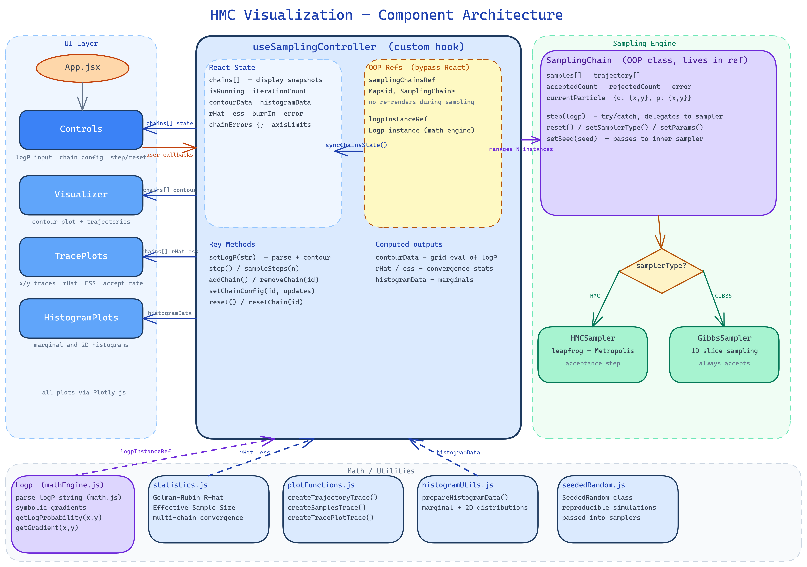

# HMC Visualization

Interactive web application to visualize the Hamiltonian Monte Carlo (HMC) and Gibbs sampling algorithms.
Run simulations, explore phase space trajectories, and analyze convergence with real-time diagnostics.

## Features

- **Interactive Simulation**: Tunable parameters per sampler (Step Size, Integration Time for HMC; Step Multiplier for Gibbs).
- **Multiple Sampling Algorithms**:
  - **HMC**: Hamiltonian Monte Carlo with leapfrog integrator and Metropolis acceptance.
  - **Gibbs**: Gibbs Sampling with Slice Sampling for robust 1D conditional updates ("Manhattan" trajectories).
- **Target Distributions**: Choose from predefined distributions (Gaussian, Rosenbrock, Donut, etc.) or define your own custom log-probability function.
- **Multi-Chain Support**: Up to 6 independent chains, each with its own sampler type and parameter set. Chains are color-coded and displayed in collapsible panels.
- **Group-by-Type Statistics**: Chains of the same sampler type are automatically merged for histograms and diagnostics. R-hat and ESS are computed per sampler-type group, enabling meaningful comparison even in mixed-sampler sessions.
- **Fast Sampling Mode**: Batch-processes all iterations before rendering, for rapid exploration without frame-by-frame animation.
- **Seed Configuration**: Per-chain random seed input for fully reproducible simulations.
- **GIF Recording**: "Start/Stop Recording" button captures the trajectory plot frame-by-frame and downloads a `sampling-recording.gif` when stopped.
- **Visualizations**:
  - **2D Trajectory**: Real-time visualization of each chain's path in phase space, color-coded per chain.
  - **Trace Plots**: Monitor X and Y coordinates over time for all chains to detect mixing issues.
  - **Histograms**: Marginal (1D) and Joint (2D) histograms, one panel per sampler-type group.
- **Diagnostics**:
  - **Gelman-Rubin (R-hat)**: Convergence diagnostic computed per sampler-type group (requires ≥ 2 chains of the same type).
  - **Effective Sample Size (ESS)**: Computed per sampler-type group.
  - **Burn-in Control**: Specify initial samples to discard to ensure analysis on the stationary distribution.

## Architecture



The application is built around a central `useSamplingController` hook that bridges React's state model with OOP sampling objects:

- **UI Layer** (`App.tsx`, `Controls`, `Visualizer`, `TracePlots`, `HistogramPlots`) — pure display components that receive state and callbacks as props. All plots use Plotly.js.
- **`useSamplingController` (custom hook)** — single source of truth for all React state. Holds chain configs, iteration counters, contour data, and statistics. Maintains `SamplingChain` OOP instances in refs (not state) to avoid re-renders during hot sampling loops. Exposes callbacks (`setLogP`, `sampleSteps`, `addChain`, `removeChain`, etc.) to the UI. Groups chains by sampler type for post-processing: `prepareHistogramDataByType` merges samples per group, and `GroupStats[]` carries per-group R-hat and ESS.
- **Sampling Engine** — `SamplingChain` wraps a single Markov chain: instantiates the concrete sampler, accumulates samples and trajectory points, and delegates each step. Sampler type decides between `HMCSampler` (leapfrog integrator + Metropolis acceptance) and `GibbsSampler` (coordinate-wise 1D slice sampling, always accepts). `defaultConfigs.ts` provides initial parameter shapes for each sampler type.
- **Recording** — `useRecording` hook captures Plotly graph frames via `Plotly.toImage` during sampling and encodes them into a downloadable GIF using `gifshot`.
- **Math / Utilities** — `Logp` (`mathEngine.ts`) parses user-supplied log-probability strings with math.js and computes symbolic gradients. `statistics.ts` provides Gelman-Rubin R-hat and ESS. `plotFunctions.ts` generates Plotly traces and exports `CHAIN_COLORS`, the shared 6-color palette used across all plots and UI panels.

The key design decision is the **ref-state duality**: `SamplingChain` instances live in a `useRef` Map and mutate freely during sampling; after each step `syncChainsState()` copies trajectory, samples, and counters into React state to trigger a render.

## Prerequisites

- **Node.js** (v18 or higher)
- **npm** (comes with Node.js)

## Setup Development Environment

### 1. Clone the Repository

```bash
git clone <repository-url>
cd HMC_visualization
```

### 2. Install Dependencies

```bash
npm install
```

## Development

### Run Development Server

```bash
npm run dev
```

This starts the Vite development server with hot module replacement (HMR).
The application will be available at `http://localhost:5173`

### Run Tests

```bash
npm run test -- --run
```

To run with coverage:

```bash
npm run test:coverage
```

### Code Quality

```bash
npm run lint
npm run format
```

**Pre-commit Hooks**:

This project uses [Husky](https://typicode.github.io/husky/) and [lint-staged](https://github.com/lint-staged/lint-staged) to automatically run code quality checks before each commit:

- `tsc --noEmit` type-checks the full `src/` tree and blocks commits with type errors
- Prettier auto-fixes formatting on staged files
- ESLint auto-fixes linting issues on staged files
- Commits are blocked if ESLint finds errors that can't be auto-fixed

## Build

### Create Production Build

```bash
npm run build
```

This creates an optimized production build in the `dist/` directory.

### Preview Production Build

```bash
npm run preview
```

Preview the production build locally before deployment.

## Project Structure

```
src/
├── components/          # React components
│   ├── Controls.tsx     # Parameter and simulation controls (collapsible per-chain panels)
│   ├── Visualizer.tsx   # Main 2D trajectory plot
│   ├── TracePlots.tsx   # X/Y trace plots with per-group diagnostics
│   └── HistogramPlots.tsx # Marginal and 2D histograms (one panel per sampler-type group)
├── hooks/               # Custom React hooks
│   ├── useSamplingController.ts # Central logic for simulation state and statistics
│   └── useRecording.ts  # GIF recording: frame capture and gifshot encoding
├── samplers/            # Sampling algorithms
│   ├── BaseSampler.ts     # Abstract base class for samplers
│   ├── HMCSampler.ts      # Hamiltonian Monte Carlo implementation
│   ├── GibbsSampler.ts    # Gibbs Sampler (using Slice Sampling)
│   ├── SamplingChain.ts   # Single-chain wrapper: instantiates sampler, accumulates samples
│   └── defaultConfigs.ts  # Default parameter objects per sampler type
├── utils/               # Core logic modules
│   ├── mathEngine.ts    # Math.js wrappers for parsing & gradients
│   ├── plotConfig.json  # Centralized Plotly configuration
│   ├── plotFunctions.ts # Plotly trace generation helpers; exports CHAIN_COLORS palette
│   ├── statistics.ts    # Statistical functions (R-hat, ESS)
│   ├── seededRandom.ts  # PRNG for reproducible simulations
│   ├── sliceSampler.ts  # 1D Slice Sampling utility for Gibbs updates
│   ├── predefinedFunctions.ts # Library of target distributions
│   ├── histogramUtils.ts # Histogram data processing (group-by-type merging)
│   └── logger.ts        # Structured logger (DEBUG/INFO/WARN/ERROR; level from Vite mode)
├── types.ts             # Shared TypeScript interfaces and type aliases
├── App.tsx              # Main application component
├── main.tsx             # React entry point
└── index.css            # Global styles

tests/
├── components/          # Component tests
├── hooks/               # Hook tests
├── samplers/            # Sampler tests
└── utils/               # Unit tests
```

## Technology Stack

- **Framework**: React with Vite
- **Language**: TypeScript (`strict: true`; tests remain in JavaScript)
- **Math Engine**: math.js (symbolic differentiation)
- **Visualization**: plotly.js (react-plotly.js)
- **Testing**: Vitest with jsdom (via React Testing Library)
- **GIF Encoding**: gifshot
- **Styling**: Vanilla CSS
- **Code Quality**: ESLint, Prettier, TypeScript (`tsc --noEmit`)
- **Pre-commit Hooks**: Husky, lint-staged
- **CI/CD**: GitHub Actions

## CI/CD

This project uses [GitHub Actions](./.github/workflows/ci.yml) for continuous integration. The CI pipeline runs automatically on:

- All pull requests
- Pushes to the `main` branch

### CI Checks

**Lint Job** (Node 20, Ubuntu):

- Runs ESLint to check for code errors
- Verifies Prettier formatting
- Runs `tsc --noEmit` to catch type errors independently of the build

**Test Job** (Node 18 & 20, Ubuntu):

- Runs all Vitest unit tests with coverage
- Ensures compatibility across Node.js LTS versions

**Build Job** (Node 20, Ubuntu):

- Creates production build
- Verifies build artifacts

**All jobs must pass before a PR can be merged.**

## Contributing

- [Contributing Guide](./docs/contributing.md) — fork-based workflow, dev setup, code style, testing conventions, and PR checklist for new contributors.
- [Adding a New Sampler](./docs/adding-a-sampler.md) — step-by-step walkthrough of every file to touch when implementing a new sampling algorithm.
